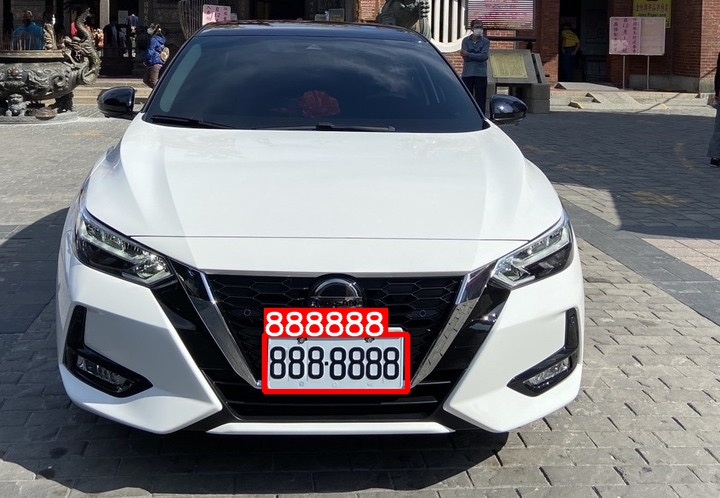

## Steps to run Code

- Clone the repository
```
git clone https://github.com/410011max/YOLOv5-LPRNet-Licence-Recognition.git
```
- Goto the cloned folder.
```
cd YOLOv5-LPRNet-Licence-Recognition
```
- Install the dependecies
```
pip install -r requirements.txt
```
- Run yolov8 object detection + Tracking + Vehicle Counting
```
python main.py --source demo/source
```

## Result


